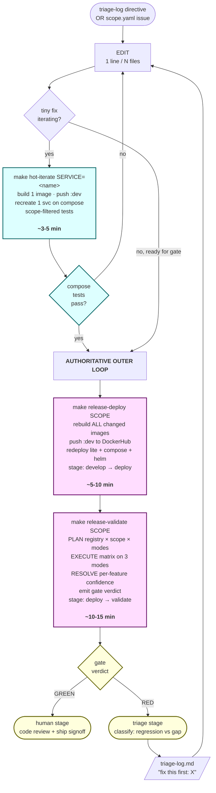

# Release flow — develop → gate

Two-loop architecture: cheap inner loop on compose for fast feedback, fresh
authoritative outer loop on all modes for the gate. Same tooling, different
trigger.

> Status: hot-iterate inner loop landed in v0.10.5.3 (commit `b823989`).
> See `tests3/stages/03-develop.md` and `tests3/stages/06-validate.md`.

---

## Visual — ASCII

```
┌──────────────────────────────────────────────────────────────────────────┐
│                                                                          │
│  DEVELOP                                                                 │
│  ───────                                                                 │
│                                                                          │
│   triage-log.md "fix this first: X" ──┐                                  │
│   OR plan-approved scope              │                                  │
│                                       ▼                                  │
│                              ┌───────────────┐                           │
│                              │     EDIT      │ ◀──── (1 line / N files)  │
│                              └───────┬───────┘                           │
│                                      │                                   │
│   ┌──────────────────────────────────┼──────────────────────────────┐   │
│   │   INNER LOOP (hot)               ▼      ~3-5 min wall-clock     │   │
│   │                       ┌─────────────────────┐                    │   │
│   │                       │ make hot-iterate    │                    │   │
│   │                       │ SERVICE=<name>      │                    │   │
│   │                       │ [SCOPE=...]         │                    │   │
│   │                       └─────────┬───────────┘                    │   │
│   │                                 │                                │   │
│   │                                 ▼                                │   │
│   │              ┌──────────────────────────────────────┐            │   │
│   │              │ docker build  ONE   image            │ ~2 min     │   │
│   │              │ docker push   :dev  tag              │ ~30s       │   │
│   │              │ ssh compose VM                       │            │   │
│   │              │   docker compose pull <svc>          │            │   │
│   │              │   docker compose up -d --no-deps     │            │   │
│   │              │       --force-recreate <svc>         │ ~10s       │   │
│   │              │ scope-filtered tests on compose      │ ~2 min     │   │
│   │              └─────────────────┬────────────────────┘            │   │
│   │                                │                                 │   │
│   │                                ▼                                 │   │
│   │                       ┌──────────────┐                           │   │
│   │                       │ compose pass?│                           │   │
│   │                       └──────┬───────┘                           │   │
│   │                              │                                   │   │
│   │           ┌──────────────────┴──────────────────┐                │   │
│   │           │ no — iterate edit                   │ yes            │   │
│   │           ▼                                     ▼                │   │
│   │       (back to EDIT)                     exit inner loop         │   │
│   └─────────────────────────────────────────────────────────────────┘   │
│                                              │                           │
│                                              ▼                           │
│                                  authoritative outer below               │
│                                                                          │
└──────────────────────────────────────────────────────────────────────────┘
                                              │
                                              ▼
┌──────────────────────────────────────────────────────────────────────────┐
│                                                                          │
│  AUTHORITATIVE OUTER LOOP (the gate)         ~20-30 min wall-clock       │
│  ────────────────────────────────────                                    │
│                                                                          │
│                                  ┌───────────────────────┐               │
│                                  │ make release-deploy   │ ~5-10 min     │
│                                  │ SCOPE=<scope>         │               │
│                                  └───────────┬───────────┘               │
│                                              │                           │
│                                              ▼                           │
│                  ┌──────────────────────────────────────────┐            │
│                  │  rebuild ALL changed images (8+ services)│            │
│                  │  push  :dev  to DockerHub                │            │
│                  │  redeploy lite + compose + helm parallel │            │
│                  │  stage: develop → deploy                 │            │
│                  └──────────────────────┬───────────────────┘            │
│                                         │                                │
│                                         ▼                                │
│                                  ┌───────────────────────┐               │
│                                  │ make release-validate │ ~10-15 min    │
│                                  │ SCOPE=<scope>         │               │
│                                  └───────────┬───────────┘               │
│                                              │                           │
│                                              ▼                           │
│                  ┌──────────────────────────────────────────┐            │
│                  │  PLAN     filter registry × scope × modes│            │
│                  │  EXECUTE  full matrix on lite+compose+helm│           │
│                  │  RESOLVE  aggregate per-feature confidence│           │
│                  │  GATE     emit verdict                   │            │
│                  │  stage: deploy → validate                │            │
│                  └──────────────────────┬───────────────────┘            │
│                                         │                                │
│                                         ▼                                │
│                                  ┌─────────────┐                         │
│                                  │   verdict   │                         │
│                                  └──────┬──────┘                         │
│                                         │                                │
│                       ┌─────────────────┴─────────────────┐              │
│                       │                                   │              │
│                       ▼                                   ▼              │
│                  ┌─────────┐                       ┌────────────┐        │
│                  │  GREEN  │                       │     RED    │        │
│                  │ → human │                       │  → triage  │        │
│                  └─────────┘                       └─────┬──────┘        │
│                                                          │               │
└──────────────────────────────────────────────────────────┼───────────────┘
                                                           │
                                                           ▼
                                            triage-log.md "fix this first: X"
                                                           │
                                                           ▼
                                                back to DEVELOP top
```

## Visual — Mermaid (renders in GitHub markdown)



---

## Decision rule — when to use which loop

| You're about to... | Use |
|---|---|
| Edit code in response to triage-log directive | **inner (hot-iterate)** |
| Edit code as part of develop-stage initial implementation | **inner (hot-iterate)** for incremental verification |
| Believe the fix has converged + ready for the gate | **outer (release-deploy + release-validate)** |
| Need cross-mode signal (lite + compose + helm) | **outer** — inner is compose-only |
| Need to confirm "no other regression" before human stage | **outer** — gate-grade |

---

## Why the split

Pre-`v0.10.5.3` we had only the outer loop. Triage→develop→re-validate was
20-30 min per code-edit. A 1-line typo fix burned the same wall-clock as
a real fix. Over a release cycle that's hours of compute + human attention
on cycles where the actual change was trivial.

The shortcut people reach for under that pressure: skip validate, ship
on "looks fine in compose locally" or `release-iterate` (scope-filtered,
not authoritative). That weakens the gate — exactly the failure mode
audit-stage proposal exists to prevent.

Hot-iterate is the **right** shortcut: cheaper inner loop without
weakening the outer gate. The gate is still fresh, full, cross-mode.

---

## What the inner loop is NOT

- **NOT a gate.** Compose-only. No lite, no helm. No cross-mode signal.
- **NOT authoritative.** A "compose tests pass" outcome doesn't enter
  human stage. You still need the outer release-validate to transition
  validate → human.
- **NOT for sign-off.** Hot-iterate proves the fix moves the right test
  from red to green; it doesn't prove no other regression in lite/helm.
- **NOT a replacement for triage discipline.** A failing inner-loop
  test still gets root-cause analysis, not retry-until-green.

---

## Stage transitions across the loops

```
develop ──(hot-iterate, no transition)── develop ── ... ── develop
   │                                                          │
   │                                                          │ release-deploy
   │                                                          ▼
   │                                                       deploy
   │                                                          │
   │                                                          │ release-validate
   │                                                          ▼
   │                                                       validate
   │                                                          │
   │                                          GREEN ──────────┼───── RED
   │                                            │             │       │
   │                                            ▼             │       ▼
   │                                          human           │     triage
   │                                                          │       │
   └──────────────────────────────────────────────────────────┴───────┘
                                                                fix directive
                                                            (back to develop)
```

The inner hot-iterate loop runs ENTIRELY within `develop` — no stage
transition. The outer loop drives the formal develop → deploy → validate
→ {human|triage} progression.
